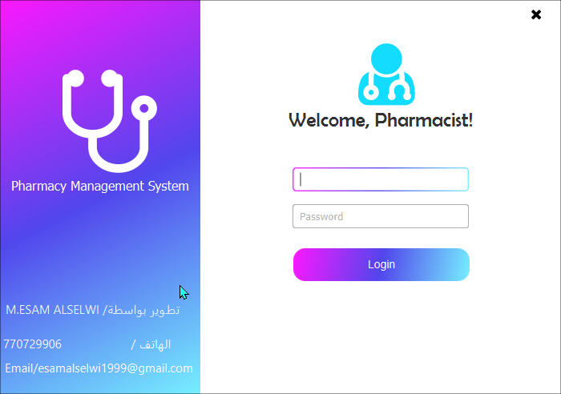
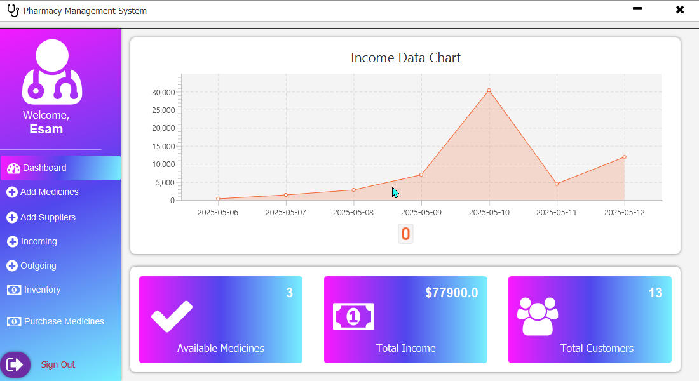
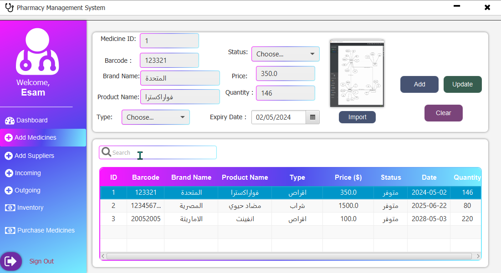
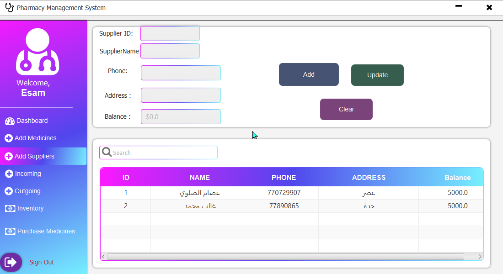
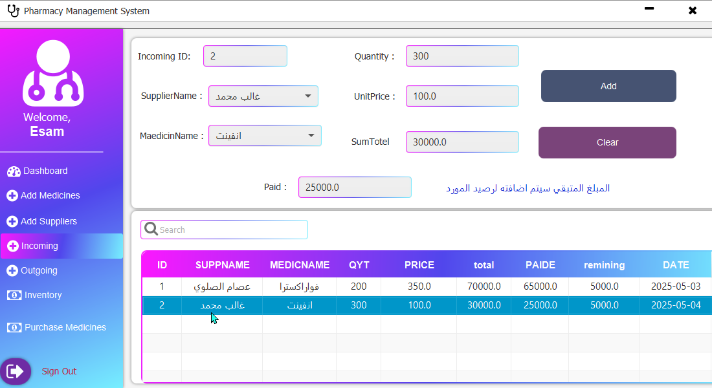
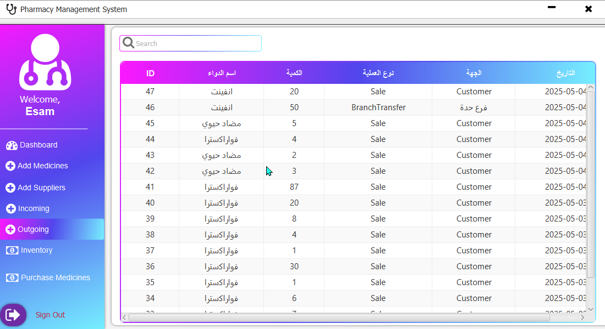
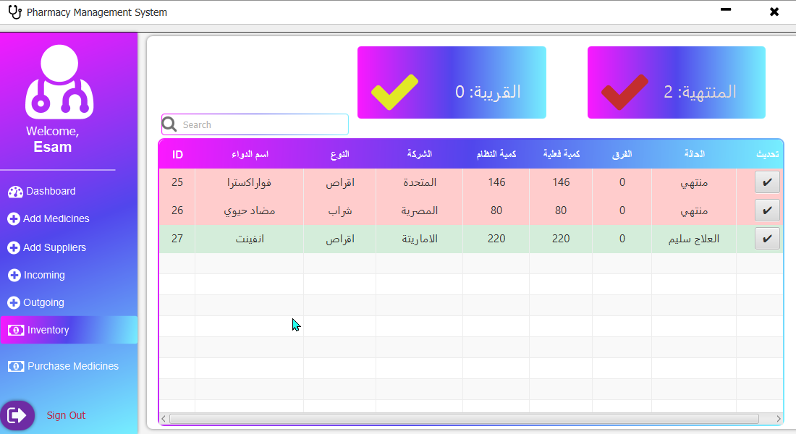

# 💊 Pharmacy Management System (JavaFX)

> ⚠️ **For Showcase Only — Source code is not included**  
> 🚫 This repository is for portfolio presentation only. Do not copy or reuse the design.

---

## 📋 Overview

This project is a desktop-based pharmacy management system built using JavaFX and MySQL.  
It includes features for managing medicines, sales, reports, and users (Admin & Cashier).  
This repository displays the interface screenshots only.  
The source code is kept private to protect intellectual property.

---

## 🔑 Features

- Add, edit, delete medicines  
- Manage sales and generate invoices  
- Customer and stock management  
- Daily and monthly reports  
- Secure login system with roles

---

## 🛠️ Technologies Used

- Java 11  
- JavaFX 17  
- MySQL  
- SceneBuilder  
- Maven / NetBeans

---

## 📸 Screenshots

### 🔹 Login Screen  

### 🔹 Dashboard  

### 🔹 Medicine Interface  

### 🔹 Suppliers Page  

### 🔹 Incoming Page  

### 🔹 Outgoing Page  

### 🔹  Inventory Interface

### 🔹  Purchase Interface

---

## 🔒 License

This project is for **educational and portfolio purposes only**.  
**No source code is provided**.  
All rights reserved © 2025 — Esam Adel Alselwi  
Contact: esamalselwi404@gmail.com
